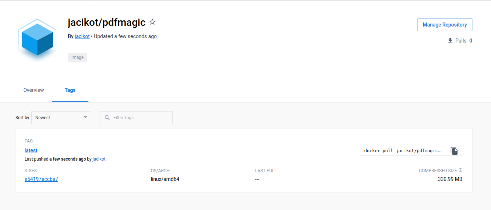

# Scaling horizontally a web service

## The Pdfmagic service [40']

### Overview

*[Q] Quickly browse through the source code of the Pdfmagic service.
Where is located the pdf document on the server before being sent back
to the client?*

The pdf document will be located in ``/tmp`` folder.  
The document will be named ``<uuid>.jpg``.

### A container to hold the magic

*[Q] Run the container locally and access it to create a pdf document from
a jpg image. Convert the logo located here. Where is the pdf document
on the server?*

The ``Dockerfile`` we used is shown below.

```Dockerfile
# Base Docker Image
FROM python:2

# Working Directory
WORKDIR /container

# Dependencies 
RUN pip install delegator.py 
RUN pip install web.py

# Add Python file to working directory
ADD pdfmagic/pdfmagic.py /container

# Expose container's port to clients  
EXPOSE 8080

# Command that runs on the container
CMD ["python", "/container/pdfmagic.py"]
```

Then, we can create the Docker image.
```bash
docker built -t pdfimage .
```

Finally, we can start the container, making a bridge between host and containers
ports 8080.
```bash
docker run -p 8080:8080 pdfimage
```

Once the service is used from a container, the pdf document will be located
in the ``/tmp`` folder of the container, which means directly
in the docker image.


## Using a container registry [20']




------------------------

get kubectl service ip address (look for the load balancer external ip):

```bash
> kubectl describe services pdfmagic
Name:                     pdfmagic
Namespace:                default
Labels:                   app=pdfmagic
Annotations:              <none>
Selector:                 app=pdfmagic
Type:                     LoadBalancer
IP Family Policy:         SingleStack
IP Families:              IPv4
IP:                       10.3.243.209
IPs:                      10.3.243.209
LoadBalancer Ingress:     35.195.0.151
Port:                     <unset>  8080/TCP
TargetPort:               8080/TCP
NodePort:                 <unset>  31991/TCP
Endpoints:                10.0.0.12:8080
Session Affinity:         None
External Traffic Policy:  Cluster
Events:                   <none>
```


## Single client


## Multiple clients


## Load Balancer


## Load balancer

```bash
kubectl expose deployment pdfmagic --type=LoadBalancer
```